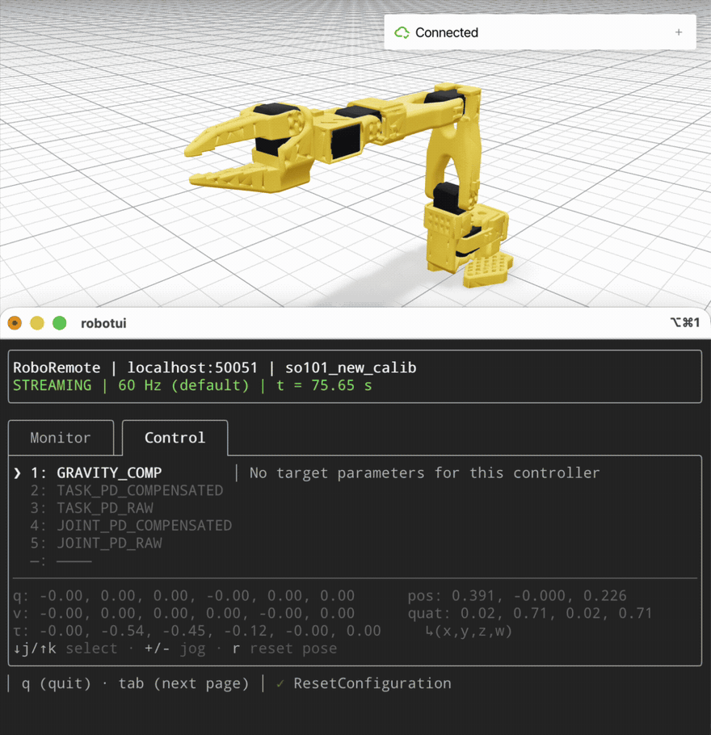
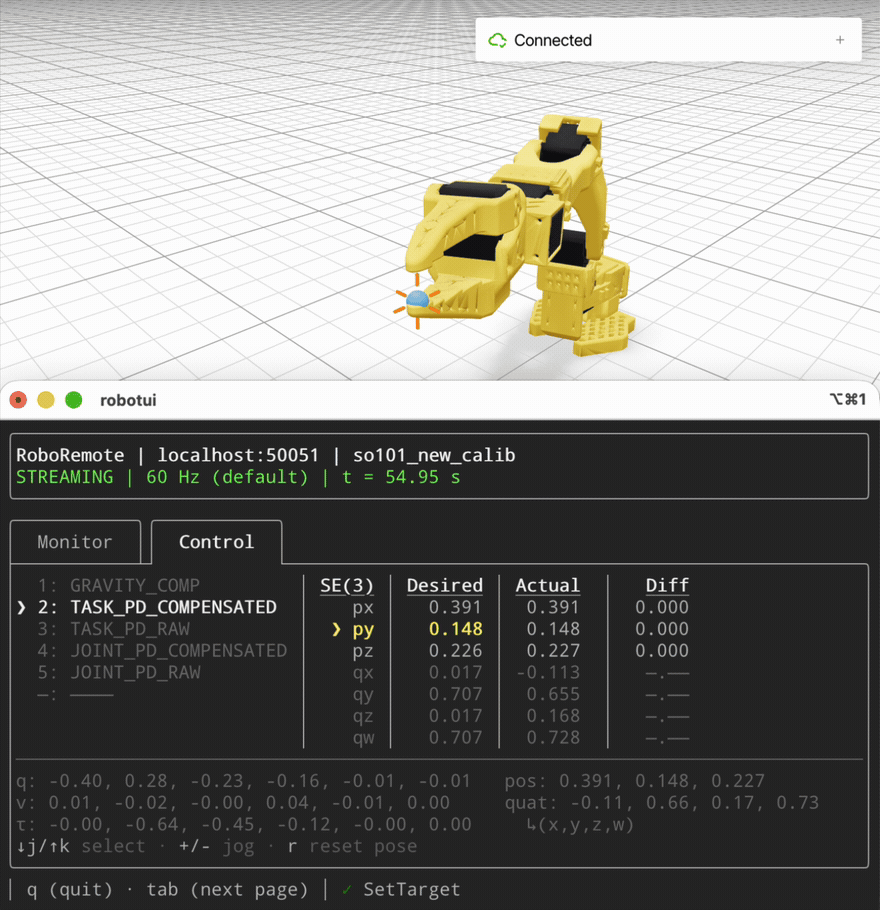
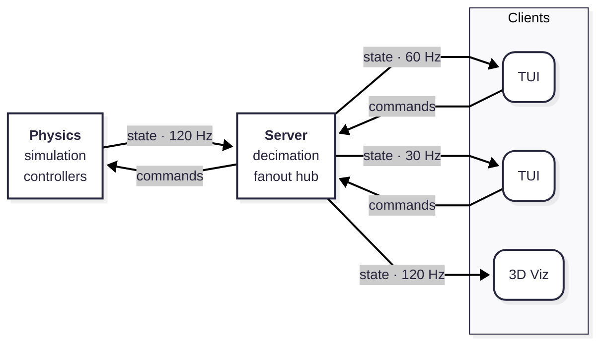

# roboremote
**A torque-controlled simulation of a robotic arm you can command over the network**

Command an interactive, realtime physics simulation of an SO-101 robotic manipulator. Provide a Cartesian target to track a position with operational-space control or provide joint angles to track a specific robot pose. Toggle nonlinear compensation off to watch tracking error open up as gravity and inertial terms go uncancelled. Attach multiple clients, including the visualizer, to watch your robot whether it's simulated on your local machine or a distant, headless box.



## Quickstart

Roboremote runs entirely in containers, so you can skip installing its Go, Python, Pinocchio, and gRPC toolchain. You only need [Docker](https://docs.docker.com/get-docker/) with Compose v2.

> [!NOTE]
> Configuration comes from environment variables defined in a required `.env` file at the repo root. Copy the template before your first run to use the default configuration.

```bash
git clone https://github.com/msdemers/roboremote.git
cd roboremote
cp .env.example .env
```

**1. Start the physics simulation server and the relay server**

```bash
docker compose up
```

Wait for the physics and relay services to report ready:

```text
physics-1  | === Starting Physics Sidecar ===
physics-1  | physics sidecar listening on 0.0.0.0:50052
Container roboremote-physics-1 Healthy
server-1   | Sim relay server is listening on port 0.0.0.0:50051...
```

**2. Attach the terminal client**

In a second terminal:

```bash
docker compose run --rm tui
```

The header should read `STREAMING` with live simulation time, `t = ` ticking upward.

> [!TIP]
> Prefer to skip the container and run directly in your terminal? `make run-tui` runs the client directly against the containerized stack. It requires the Go toolchain (1.26+)

**3. Open the 3D viewer** (optional)
```bash
docker compose run --rm -P viz
```

Then open <http://localhost:8080> in your browser.

> [!TIP]
> You can run the visualizer directly from your terminal as well. `make run-viz` launches the viz server and auto opens the viewer in your default browser. It requires Astral's [uv](https://docs.astral.sh/uv/) package manager.

**4. Stopping**

Press `q` and confirm with `y` in the terminal client to quit. To tear down the physics and relay services stack:

```bash
docker compose down
```

...or simply `ctrl-c` from the terminal window running docker-compose.

## What You Can Do

| Mode | What you set | What to watch |
|---|---|---|
| `[1] GRAVITY_COMP` | No input | holds current pose in the workspace |
| `[2] TASK_PD_COMPENSATED` | Desired Cartesian position | converges to target position and holds bias-free |
| `[3] TASK_PD_RAW` | Desired Cartesian position | settles below target |
| `[4] JOINT_PD_COMPENSATED` | Desired joint coordinates | converges to desired pose and holds bias-free |
| `[5] JOINT_PD_RAW` | Desired joint coordinates | settles below desired pose |

*Raw modes apply pure proportional-derivative control torques. Compensated modes add computed torque for mitigating biases due to gravity and inertial nonlinearities.*

Interaction: `tab` between pages, `[1-5]` select control mode, `j`/`k` to select, `-`/`+` to adjust (hold for fast-jog), `r` to reset to default pose

> [!NOTE]
> The TUI footer always shows the available keys for the current page/view.



*Task-space control of a Cartesian target, starting with compensation on. Compensation off at `t = 58.20 s` leaving the gravity and inertial terms uncancelled. The end effector sags 2 cm in the vertical within 1 second and holds there until compensation returns, when tracking recovers in ~0.2 s. The elbow stays drooped because position control constrains the end effector, not the posture. The reset at the end restores the elbow-up posture.*

## How It Works
<!-- Diagram Note: The theme is pinned because GitHub's mermaid renderer ignores the user's system color scheme (light vs dark mode); don't "fix" it until github fixes their end. -->


*All links are gRPC: state on server-streams, commands as unary RPCs. Physics simulates at 1 kHz (1 ms integrator steps) and publishes at 120 Hz. The relay server decimates the state-stream to each client's requested rate (30/60/120 Hz, default 60).*

### Physics
Physics simulation comprises a Pinocchio rigid body dynamics model, feedback control torques, and an integrator (semi-implicit Euler) with a 1 ms fixed step. Control modes with nonlinear compensation employ computed torque control using the Recursive Newton Euler Algorithm (RNEA). Task-space modes use operational-space control with damped least squares. Joint limits and viscous damping are applied in the plant itself, not patched in the controllers.

### Server
The server acts as a relay between the physics simulation and multiple asynchronous clients. Physics owns the clock, meaning this server never advances simulation state. Instead, its hub manages and streams state messages to any state-stream subscribers, decimating according to each subscriber's `STREAM_RATE` setting. The hub's latest-value-wins slots prevent slow consumers from blocking or slowing others. Unary commands from connected clients bypass the hub and pass through to the physics service unchanged.

### Clients
Multiple clients, including the TUI and 3D Visualizer clients in this repo, can connect to the server at once. Each client subscribes to the simulation state-stream through a gRPC request that specifies `STREAM_RATE` of 30 Hz, 60 Hz (default), or 120 Hz. The stream opens with a model descriptor to enable client-side validation of all following sim-state frames. Clients send command requests as unary RPCs that switch the robot controller mode, update the desired controller target, or reset to the default pose.

## Design Decisions
This project's ongoing Architecture Decision Records (ADRs) are ordered records of each decision, its context, and its consequences. When decisions change, they appear as amendments to the ADR or a new ADR so the reasoning path stays visible. [DECISIONS.md](docs/DECISIONS.md) contains the history of 23 ADRs.

**[ADR-018](docs/DECISIONS.md#adr-018-setpoint-smoothing-is-out-of-scope-for-the-sidecar): Defer target-setpoint smoothing for a future optimal-control layer.**

Smoothing is trajectory generation, which requires its own tick-evolving state and would break the simulator's pure `(q, v, setpoint) → tau` shape. The burden of torque discontinuities falls on the layer calling `SetTarget`, where it should be.

**[ADR-019](docs/DECISIONS.md#adr-019-joint-space-control-laws--computed-torque-and-inertia-weighted-pd): Joint-space control laws employ computed-torque control and inertia-weighted PD.**

Gains are parameterized as `kp = ωn²`, `kd = 2ζωn` with `ωn=50`, `ζ=1`, so one scalar pair works across every joint with inertia-independent, uniform stability. This prevents the lightest linkages (gripper) from diverging to NaN within a few ticks.

**[ADR-020](docs/DECISIONS.md#adr-020-task-space-control--position-only-operational-space-v1): Task-space modes track position only with inertia-weighted PD.**

Task-space modes implement position-only operational-space control because the SO-101's 5-DOF system is kinematically deficient for full SE(3) tracking (6-DOF). Inertia-weighted, position-only tracking with constant Tikhonov regularization and damping over the position-task null-space allows one PD gain combo per domain to serve both compensated and uncompensated modes.

**[ADR-023](docs/DECISIONS.md#adr-023-uniform-viscous-damping-as-a-numerical-regularizer): The simulation plant applies viscous damping as a regularizer.**

The damping constant is derived from the simulation timestep and the model's smallest inertia (gripper jaw) rather than the measured loss from the servo motors. STS3215 motor damping is an order of magnitude larger than 1 ms explicit integration admits at the gripper's inertia. Consequently, feedback-control modes damp harder than the regularizer damping, which is only observable under `GRAVITY_COMP` mode.

**[ADR-009](docs/DECISIONS.md#adr-009-sidecar-publish-cadence-and-per-client-decimation): Server acts as a pure fan-out relay and decimates per subscriber with latest-value-wins slots.**

The latest-value-wins slot comes with the cost of slow clients silently missing frames, but guarantees that a slow subscriber never stalls the pump or degrades every other client. Declaring fixed, client-selected rates as integer divisors of the physics publish-rate guarantees that decimation never invents or interpolates simulation states, and suffers no jitter or beating.

**[ADR-013](docs/DECISIONS.md#adr-013-control-modes-and-targeting): Switching control mode only happens through explicit `SetControlMode`, never inferred from the gRPC `SetTarget`'s `oneof` shape.**

`CartesianPose` and `Coordinates` each fit more than one task-space mode or joint-space mode respectively, meaning `SetTarget` can't discriminate. `SetControlMode` calls also reset the target to the current state for bumpless transfer.

## Limitations

**The transport stack is unencrypted, unauthenticated gRPC (no TLS).**

Any client that can reach the published address and port can command the arm simulation. That's acceptable as a lean transport choice that keeps prototyping frictionless on a trusted Compose network. If driving simulation on a remote box, tunnel it over SSH or a VPN.

**The services and clients lack graceful shutdown or reconnect handling.**

If the physics service restarts, the pump never reconnects and the server hub goes silent. Restarting physics requires restarting the server and clients as well. Additionally, exiting with `log.Fatalf` skips any deferred cleanup on the way out.

**First-order integrator is marginally stable.**

The semi-implicit Euler integrator demonstrated ~7% energy band at the 1 ms step size in undamped free-swing tests. This is fine with numerical damping regularizing the plant plus the gravity compensation and PD controllers adding effective damping. Passive, free-swing cases instantiating `Simulator` with zero damping will destabilize over seconds.

**Damping provides numerical regularization instead of physical realism.**

The system damping added to the plant is derived for numerical stability. The actual STS3215 motor losses are roughly an order of magnitude larger and would cause simulation instability with the current integrator. Sim-to-real inaccuracies will persist until upgrading the integrator to implicit damping treatment unlocks physical values.

**Task-space control is position-only.**

You can command where the end effector goes but not how it's oriented at its target. Any job that depends on tool attitude, such as insertion at an angle or pouring, isn't expressible in today's task-space implementation. Oriented poses are still reachable through the joint-space modes.

**Rendering performance is verified in Chrome only.**

Safari exhibits intermittent render stalls. Those stalls occur after ~10 seconds without commands, last ~1 second, and are not present in the underlying state stream. If frozen visuals present an issue, use Chrome.

## Roadmap
- Cloud deployment with public demo URL
- Interactive visualizer with target dragging and physical tugging on linkages
- User-defined sensor nodes to monitor kinematics and dynamics measures
- Model picker for quick switching between prevalent commercial and educational robots
- Transport Layer Security and authentication for untrusted networks

## Development
### Prerequisites
| Tool | Needed for | Install |
|---|---|---|
| Go 1.26+ | building `server` and `tui` (version pinned in [`go.work`](go.work)) | [go.dev/doc/install](https://go.dev/doc/install) |
| uv | Python env and deps for `physics` and `viz` | [docs.astral.sh/uv](https://docs.astral.sh/uv/getting-started/installation/) |
| buf | regenerating proto stubs (`make proto`) | [buf.build/docs](https://buf.build/docs/installation) |

### Running Locally
In addition to using Docker Compose, you can run each service/client manually from your terminal.

**Terminal 1: Physics**

```bash
make run-physics
```

```text
cd physics && uv run python main.py
=== Starting Physics Sidecar ===
physics sidecar listening on 0.0.0.0:50052
```

> [!TIP]
> To change the physics bind address and service port, edit `ROBOREMOTE_PHYSICS_BIND_ADDR` and `ROBOREMOTE_PHYSICS_PORT` in your local copy of `.env`.

**Terminal 2: Relay Server**

```bash
make run-server
```

```text
cd server && go run ./cmd/roboserver
Sim relay server is listening on port 0.0.0.0:50051...
```

> [!TIP]
> To change the server bind address and service port, edit `ROBOREMOTE_SERVER_BIND_ADDR` and `ROBOREMOTE_SERVER_PORT` in your local copy of `.env`.

**Terminal 3: TUI**

```bash
make run-tui
```

> [!TIP]
> You can also provide the custom address:port for your server setup as a command line argument. For example `go run ./tui/cmd/robotui localhost:50051` or alternatively `go run ./tui/cmd/robotui localhost:50051 -debug` to also write logs to `debug.log`.

**Terminal 4: Viz**

```bash
make run-viz
```
or alternatively...
```bash
cd viz && uv run python main.py --rate 60 --open # rate can be 30, 60, or 120 Hz
```

```text
cd viz && uv run python main.py --open
=== Starting 3D Visualizer ===
Subscribing to stream updates from roboremote server...
╭────── viser (listening *:8080) ───────╮
│             ╷                         │
│   HTTP      │ http://localhost:8080   │
│   Websocket │ ws://localhost:8080     │
│             ╵                         │
╰───────────────────────────────────────╯
```

The Viser-based visualizer should auto open in your default browser.

### Testing
Running all subproject tests at once...

```bash
make test
```

...or individually.

**Physics**
```bash
uv run --directory physics pytest
```

**Server**
```bash
go test ./server/...
```

**TUI**
```bash
go test ./tui/...
```

### Regenerating Protobuf and gRPC
To revise or augment roboremote messages and transmission types, you must (1) modify the protobuf contract, (2) regenerate all Python and Go gRPC stubs, and (3) commit all regenerated gRPC stubs. Here is the step-by-step process.

**Modify the Protobuf**

The wire contract lives in one file: [protobuf contract](proto/roboremote/arm/v1/arm.proto). See [ADR-015](docs/DECISIONS.md#adr-015-proto-finalization--naming-and-error-model) which describes the project's proto conventions (e.g. naming, error model, and empty response messages)

**Regenerate the gRPC Stubs**

```bash
make proto
```

The above Make target writes generated stubs to `./proto/gen/go` and `./proto/gen/python` respectively.

> [!NOTE]
> DO NOT edit these auto-generated files. They serve as a module/package imported by the Python and Go executables.

**Commit the Generated Stubs to git**

This repo version-controls the generated gRPC stubs in order to support running and testing **immediately** upon first clone. If you've run `make proto` as part of your work, you must stage and commit the regenerated stubs before finalizing and sharing.

> [!NOTE]
> Before committing, it's good hygiene to ensure that the committed version of the gRPC stubs matches the current proto contract.

```bash
make proto-check # regenerates, then errors if the generated stubs aren't committed.
```

Silence means pass. If the stubs are stale, you'll see:

```text
DRIFTED - generated proto changed and needs commit
```

```bash
git add proto/gen && git commit -m "chore: keep repo gRPC stubs current"
```

## Why This Exists

From computational biomechanics to combat arts, I've been studying human movement for over two decades. My expertise in simulation (OpenSim) and wearables sensing (Core Motion algorithms) shares common foundations with robotics technology: rigid-body dynamics, state estimation, control theory, optimization, and more. A musculoskeletal model is a kinematic chain like a robotic manipulator, and the recursive algorithms (Featherstone) apply in both cases. This repo is one passion project where I tackle concrete robotics applications using tooling from around the robotics ecosystem.

To learn more about my background or discuss biomechanics, robotics, wearables sensing, and artificial intelligence, find me on [LinkedIn](https://www.linkedin.com/in/matthewdemers/).
