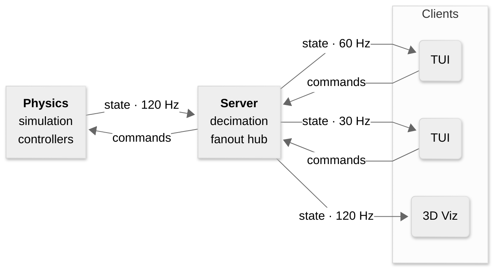

# roboremote
**A torque-controlled simulation of a robotic arm you can command over the network**

Command an interactive, realtime physics simulation of an SO-101 robotic manipulator. Provide a Cartesian target to track a position with operational-space control or provide joint angles to track a specific robot pose. Toggle nonlinear compensation off to watch tracking error open up as gravity and inertial terms go uncancelled. Attach multiple clients, including the visualizer, to watch your robot whether it's simulated on your local machine or a distant, headless box.


## Quickstart

Roboremote runs entirely in containers, so you can skip installing its Go, Python, Pinocchio, and gRPC toolchain. You only need [Docker](https://docs.docker.com/get-docker/) with Compose v2.

> [!NOTE] 
> Configuration comes from environment variables defined in a required `.env` file at the repo root. Copy the template before your first run to use the default configuration.

```bash
git clone https://github.com/msdemers/roboremote.git
cd roboremote
cp .env.example .env
```

**1. Start the physics simulation server and the relay server**

```bash
docker compose up
```

Wait for the physics and relay services to report ready:

```text
physics-1  | === Starting Physics Sidecar ===
physics-1  | physics sidecar listening on 0.0.0.0:50052
Container roboremote-physics-1 Healthy
server-1   | Sim relay server is listening on port 0.0.0.0:50051...
```

**2. Attach the terminal client**

In a second terminal:

```bash
docker compose run --rm tui
```

The header should read `STREAMING` with live simulation time, `t = ` ticking upward.

> [!TIP]
> Prefer to skip the container and run directly in your terminal? `make run-tui` runs the client directly against the containerized stack. It requires the Go toolchain (1.26+)

**3. Open the 3D viewer** (optional)
```bash
docker compose run --rm -P viz
```

Then open <http://localhost:8080> in your browser.

> [!TIP]
> You can run the visualizer directly from your terminal as well. `make run-viz` launches the viz server and auto opens the viewer in your default browser. It requires Astral's [uv](https://docs.astral.sh/uv/) package manager.

**4. Stopping**

Press `q` and confirm with `y` in the terminal client to quit. To tear down the physics and relay services stack:

```bash
docker compose down
```

...or simply `ctrl-c` from the terminal window running docker-compose.

## What you can do

| Mode | What you set | What to watch |
|---|---|---|
| `[1] GRAVITY_COMP` | No input | holds current pose in the workspace |
| `[2] TASK_PD_COMPENSATED` | Desired Cartesian position | converges to target position and holds bias-free |
| `[3] TASK_PD_RAW` | Desired Cartesian position | settles below target |
| `[4] JOINT_PD_COMPENSATED` | Desired joint coordinates | converges to desired pose and holds bias-free |
| `[5] JOINT_PD_RAW` | Desired joint coordinates | settles below desired pose |

*Raw modes apply pure proportional-derivative control torques. Compensated modes add computed torque for mitigating biases due to gravity and inertial nonlinearities.*

Interaction: `tab` between pages, `[1-5]` select control mode, `j`/`k` to select, `-`/`+` to adjust, `r` to reset to default pose

> [!NOTE]
> The TUI footer always shows the available keys for the current page/view.


*Same target throughout. Compensation off at t = xx.x s — tracking error opens as gravity and inertial terms go uncancelled — back on at t = yy.y s.*

## How it works



## Design decisions

## Limitations

## Roadmap

## Development

## Motivation | Rationale | Attribution (Needs final heading title)

