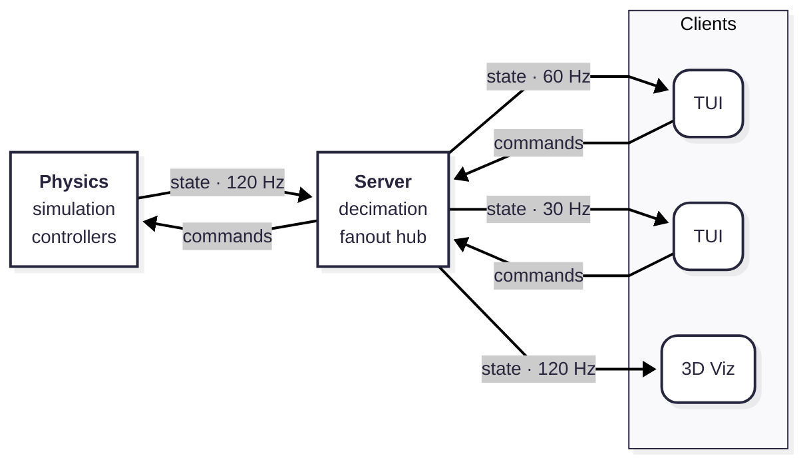

# roboremote
**A torque-controlled simulation of a robotic arm you can command over the network**

Command an interactive, realtime physics simulation of an SO-101 robotic manipulator. Provide a Cartesian target to track a position with operational-space control or provide joint angles to track a specific robot pose. Toggle nonlinear compensation off to watch tracking error open up as gravity and inertial terms go uncancelled. Attach multiple clients, including the visualizer, to watch your robot whether it's simulated on your local machine or a distant, headless box.


## Quickstart

Roboremote runs entirely in containers, so you can skip installing its Go, Python, Pinocchio, and gRPC toolchain. You only need [Docker](https://docs.docker.com/get-docker/) with Compose v2.

> [!NOTE] 
> Configuration comes from environment variables defined in a required `.env` file at the repo root. Copy the template before your first run to use the default configuration.

```bash
git clone https://github.com/msdemers/roboremote.git
cd roboremote
cp .env.example .env
```

**1. Start the physics simulation server and the relay server**

```bash
docker compose up
```

Wait for the physics and relay services to report ready:

```text
physics-1  | === Starting Physics Sidecar ===
physics-1  | physics sidecar listening on 0.0.0.0:50052
Container roboremote-physics-1 Healthy
server-1   | Sim relay server is listening on port 0.0.0.0:50051...
```

**2. Attach the terminal client**

In a second terminal:

```bash
docker compose run --rm tui
```

The header should read `STREAMING` with live simulation time, `t = ` ticking upward.

> [!TIP]
> Prefer to skip the container and run directly in your terminal? `make run-tui` runs the client directly against the containerized stack. It requires the Go toolchain (1.26+)

**3. Open the 3D viewer** (optional)
```bash
docker compose run --rm -P viz
```

Then open <http://localhost:8080> in your browser.

> [!TIP]
> You can run the visualizer directly from your terminal as well. `make run-viz` launches the viz server and auto opens the viewer in your default browser. It requires Astral's [uv](https://docs.astral.sh/uv/) package manager.

**4. Stopping**

Press `q` and confirm with `y` in the terminal client to quit. To tear down the physics and relay services stack:

```bash
docker compose down
```

...or simply `ctrl-c` from the terminal window running docker-compose.

## What You Can Do

| Mode | What you set | What to watch |
|---|---|---|
| `[1] GRAVITY_COMP` | No input | holds current pose in the workspace |
| `[2] TASK_PD_COMPENSATED` | Desired Cartesian position | converges to target position and holds bias-free |
| `[3] TASK_PD_RAW` | Desired Cartesian position | settles below target |
| `[4] JOINT_PD_COMPENSATED` | Desired joint coordinates | converges to desired pose and holds bias-free |
| `[5] JOINT_PD_RAW` | Desired joint coordinates | settles below desired pose |

*Raw modes apply pure proportional-derivative control torques. Compensated modes add computed torque for mitigating biases due to gravity and inertial nonlinearities.*

Interaction: `tab` between pages, `[1-5]` select control mode, `j`/`k` to select, `-`/`+` to adjust, `r` to reset to default pose

> [!NOTE]
> The TUI footer always shows the available keys for the current page/view.


*Same target throughout. Compensation off at t = xx.x s — tracking error opens as gravity and inertial terms go uncancelled — back on at t = yy.y s.*

## How it Works
<!-- Diagram Note: The theme is pinned because GitHub's mermaid rederer ignores the user's system color scheme (light vs dark mode); don't "fix" it until github fixes their end. -->


*All links are gRPC: state on server-streams, commands as unary RPCs. Physics simulates at 1 kHz (1 ms integrator steps) and publishes at 120 Hz. The relay server decimates the state-stream to each client's requested rate (30/60/120 Hz, default 60).*

### Physics
Physics simulation comprises a Pinocchio rigid body dynamics model, feedback control torques, and an integrator (semi-implicit Euler) with a 1 ms fixed step. Control modes with nonlinear compensation employ computed torque control using the Recursive Newton Euler Algorithm (RNEA). Task-space modes use operational-space control with damped least squares. Joint limits and viscous damping are applied in the plant itself, not patched in the controllers.

### Server
The server acts as a relay between the physics simulation and multiple asynchronous clients. Physics owns the clock, meaning this server never advances simulation state. Instead, its hub manages and streams state messages to any state-stream subscribers, decimating according to each subscriber's `STREAM_RATE` setting. The hub's latest-value-wins slots prevent slow consumers from blocking or slowing others. Unary commands from connected clients bypass the hub and pass through to the physics service unchanged.

### Clients
Multiple clients, including the TUI and 3D Visualizer clients in this repo, can connect to the server at once. Each client subscribes to the simulation state-stream through a gRPC request that specifies `STREAM_RATE` of 30 Hz, 60 Hz (default), or 120 Hz. The stream opens with a model descriptor to enable client-side validation of all following sim-state frames. Clients send command requests as unary RPCs that switch the robot controller mode, update the desired controller target, or reset to the default pose.

## Design Decisions
This project's ongoing Architecture Decision Records (ADRs) are ordered records of each decision, its context, and its consequences. When decisions change, they appear as amendments to the ADR or a new ADR so the reasoning path stays visible. [DECISIONS.md](docs/DECISIONS.md) contains the history of 23 ADRs.

### Major Decisions

**[ADR-018](docs/DECISIONS.md#adr-018-setpoint-smoothing-is-out-of-scope-for-the-sidecar): Defer target-setpoint smoothing for a future optimal-control layer.**

Smoothing is trajectory generation, which requires its own tick-evolving state and would break the simulator's pure `(q, v, setpoint) → tau` shape. The burden of torque discontinuities falls on the layer calling `SetTarget`, where it should be.

**[ADR-019](docs/DECISIONS.md#adr-019-control-laws--computed-torque-and-inertia-weighted-pd): Joint-space control laws employ computed-torque control and inertia-weighted PD.**

Gains are parameterized as `kp = ωn²`, `kd = 2ζωn` with `ωn=50`, `ζ=1`, so one scalar pair works across every joint with inertia-independent, uniform stability. This prevents the lightest linkages (gripper) from diverging to NaN within a few ticks.

**[ADR-020](docs/DECISIONS.md#adr-020-task-space-control--position-only-operational-space-v1): Task-space modes track position only with inertial-weighted PD.**

Task-space modes implement position-only operational-space control because the SO-101's 5-DOF system is kinematically deficient for full SE(3) tracking (6-DOF). Inertia-weighted, position-only tracking with constant Tikhonov regularization and damping over the position-task null-space allows one PD gain combo to serve both compensated and uncompensated modes. 

**[ADR-023](docs/DECISIONS.md#adr-023-uniform-viscous-damping-as-a-numerical-regularizer): The simulation plant applies viscous damping as a regularizer.**

The damping constant is derived from the simulation timestep and the model's smallest inertia (gripper jaw) rather than the measured loss from the servo motors. STS3215 motor damping is an order of magnitude larger than 1 ms explicit integration admits at the gripper's inertia. Consequently, feedback-control modes damp harder than the regularizer damping, which is only observable under `GRAVITY_COMP` mode.

## Limitations

## Roadmap

## Development

## Motivation | Rationale | Attribution (Needs final heading title)

